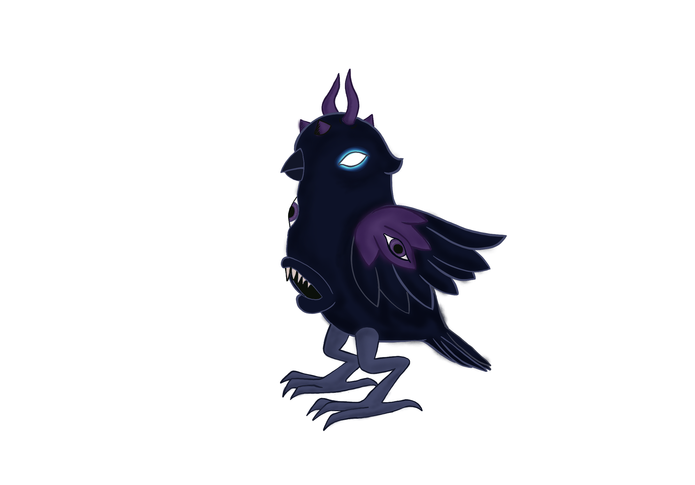
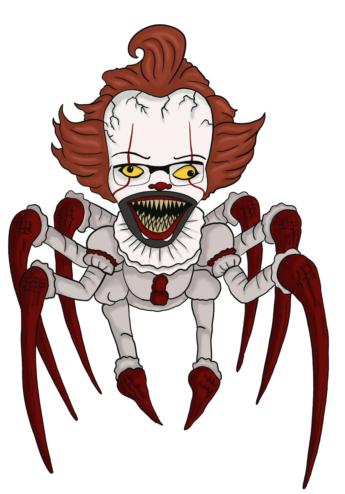
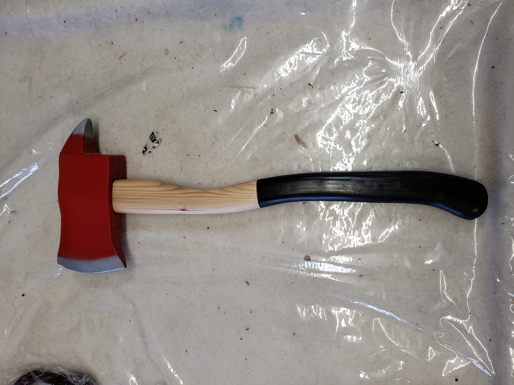

<!-- Navigation Buttons -->

  <a href="#Digitalartwork" class="btn">DigitalArtwork</a>
  <a href="#weapons" class="btn">Weapons</a>
  <a href="#sculpts" class="btn">Sculpts</a>

# My Artwork

# Digital Art 
## Azathule 
demon lord

*Digital Art, 2025*

## Angel Spraycan 

*Digital Art, 2024*

## Demon Spraycan

*digital Art, 2025*

## Skeleton Spraycan

*Digital Art, 2023*

## Sailor Moonicorn

*Digital Art, 2025*

## ScareCrow

*Digital Art, 2025*

## Wendigo

*Digital Art, 2021*

## Ronanwise The Dancing Spider

*Digital Art, 2025*

# Sculpts 

## Mercy Spraycan 
 
*Spray can Sculpt, 2019*

## Skelton Can 

*Spray Can Sculpt, 2019*

## Deadpool Can

*Spray can Sculpt, 2019*

## Tree Spraycan

*Spray can Sculpt, 2019*

# Weapons 
## Demon Sword
*foam craft, 2020*
     
    

  ## Foam Axe
   
  *foam craft, 2019*

  
